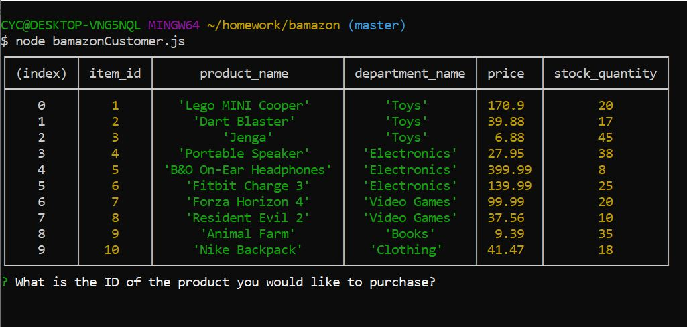
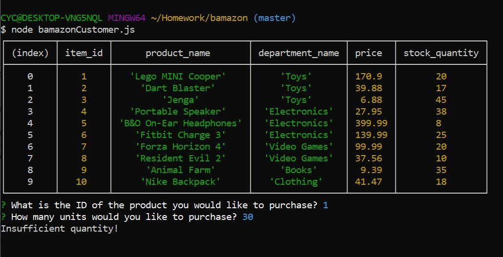
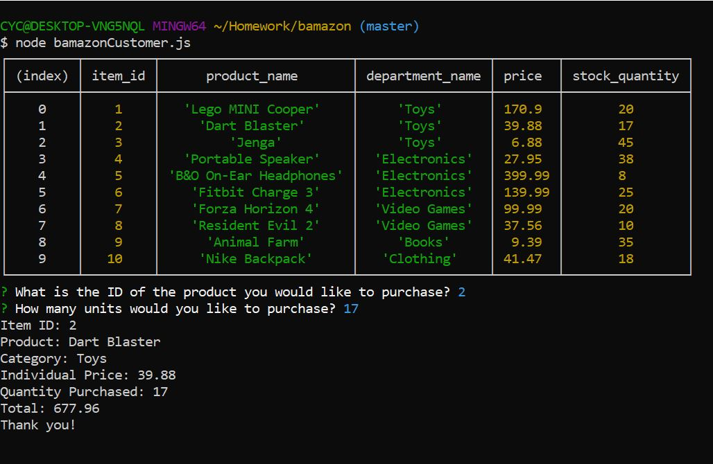

# Bamazon
## An Amazon-like storefront
Bamazon is an online store where customers can buy a variety of products. By utilizing MySQL, JavaScript, and Node.js, it allows customers to see a complete list of products with current stock quantities. It prompts the customers what product and how many they can purchase.

If the purchase quantity is more than the stock quantity, it will return a message that says "Insufficient quantity!"

If there is enough stock quantity to cover the purchase quantity, it will calculate the total cost for the customers.
